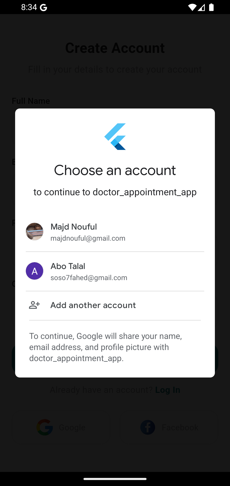

# Doctor Appointment App

A modern Flutter-based doctor appointment application that helps users browse medical specialties, explore doctors, book appointments, manage bookings, and chat with doctors through a clean and scalable mobile experience.

---

## Overview

Doctor Appointment App is a complete mobile healthcare booking solution built with **Flutter** and powered by **Firebase**.  
The app is designed to deliver a smooth user journey starting from authentication and onboarding, مرورًا بتصفح التخصصات والأطباء، وصولًا إلى حجز المواعيد والدردشة وإدارة الملف الشخصي.

The project follows a scalable feature-based structure and uses modern state management to keep the codebase organized and extendable.

---

## Features

### Authentication
- User registration with email and password
- User login with email and password
- Google Sign-In
- Logout
- Input validation
- Forgot password dialog

### Onboarding & Splash
- Custom splash screen
- Onboarding flow for first-time users
- Smooth user entry experience

### Home
- Personalized welcome section
- Categories preview
- Top doctors preview
- Search UI
- Clean and modern layout

### Categories
- View all medical categories
- Dynamic category loading from Firebase
- Icon mapping based on category data

### Doctors
- View top doctors
- View all doctors
- Doctor details screen
- Doctor info, description, pricing, and specialty display

### Appointments
- Book appointments
- Pick date and time
- Add optional notes
- View all booked appointments
- Delete appointments
- Real-time appointment updates from dashboard
- Appointment status support:
  - Pending
  - Completed
  - Cancelled

### Messages & Chat
- Real conversation system with Firestore
- Automatic conversation creation
- Doctor conversation list
- Real-time message loading
- Chat screen with send/receive flow

### Profile
- User profile screen
- Logout functionality
- Reusable profile tiles and clean UI sections

---

## Tech Stack

- **Flutter**
- **Dart**
- **BLoC**
- **Firebase Authentication**
- **Cloud Firestore**
- **Cloudinary**
- **Material Design**

---

## Architecture

This project is built using a **feature-based architecture**, where each feature is separated into its own layers for better maintainability and scalability.

### Main layers used
- **data**
  - models
  - services
  - repositories
- **presentation**
  - screens
  - widgets
  - bloc

This structure keeps the project organized and makes future expansion easier.

---

## Project Structure

```bash
lib/
│
├── app/
│   ├── app.dart
│   └── routes/
│
├── core/
│   ├── helpers/
│   ├── loading/
│   ├── services/
│   └── utils/
│
├── features/
│   ├── auth/
│   ├── home/
│   ├── all_categories/
│   ├── all_doctors/
│   ├── appointments/
│   ├── message/
│   ├── onboarding/
│   ├── profile/
│   └── splash/
│
├── firebase_options.dart
└── main.dart
Screenshots
Splash Screen
<p align="center">  </p>
Login Screen
<p align="center">  </p>
Register Screen
<p align="center">  </p>
Google Sign-In
<p align="center">  </p>
Home Screen
<p align="center">   </p>
All Categories
<p align="center">  </p>
All Doctors
<p align="center">  </p>
Doctor Details
<p align="center">   </p>
New Appointment
<p align="center">  </p>
Appointment Details
<p align="center">  </p>
Appointments Screen
<p align="center">  </p>
Delete Appointment
<p align="center">  </p>
Success Screen
<p align="center">  </p>
Messages Screen
<p align="center">  </p>
Chat Screen
<p align="center">  </p>
Profile Screen
<p align="center">  </p>
Logout
<p align="center">   </p>
Demo Video
Application Demo
<p align="center">  </p>

Demo video link will be added soon.

Firebase Collections

The application works with the following main Firestore collections:

users
doctors
categories
appointments
conversations
messages subcollection
Real-Time Features
Appointment status changes from the dashboard appear directly in the mobile app
Chat messages are loaded in real time
Conversations are automatically created and synced with Firestore
Appointment deletion and updates are reflected dynamically
Scalability & Extensibility

This project was built with future growth in mind.
The architecture is suitable for adding more advanced features without needing to rewrite the whole app.

Possible future improvements include:

Multi-language support
Dark mode / light mode
Push notifications
Appointment reminders
Seen / unread message status
Typing indicator in chat
Online / offline status
Search and filtering improvements
Role-based access for different user types
Image or file sharing in chat
Analytics and admin reporting
Better pagination for large datasets
Enhanced security rules and validation
Why This Project Matters

This is not just a simple Flutter demo app.
It is part of a larger healthcare booking system that includes:

A real mobile application for patients
A connected admin dashboard for management
Real-time synchronization using Firebase
Scalable structure for future production-level growth

This makes the project a strong portfolio example for showcasing:

Flutter UI skills
Firebase integration
State management with BLoC
Real-time data handling
Feature-based architecture
Admin Dashboard

This mobile app is connected to a separate admin dashboard used for:

Managing doctors
Managing categories
Managing appointments
Updating appointment status
Reading and replying to patient messages

The dashboard repository can be linked here later.

Author

Majd Noufal

Flutter Developer focused on building clean, modern, and scalable mobile applications using Flutter and Firebase.
