# Doctor Appointment App

A modern Flutter-based doctor appointment application that allows users to explore medical specialties, browse doctors, book appointments, manage bookings, and chat with doctors through a clean, scalable, and production-oriented mobile experience.

---

## Overview

Doctor Appointment App is a complete healthcare booking mobile application built with Flutter and powered by Firebase.

The app provides a smooth and intuitive user journey starting from onboarding and authentication, moving through doctor discovery, and ending with appointment booking, messaging, and profile management.

The project follows a feature-based architecture with BLoC state management for scalability and clean code.

---

## Key Features

### Authentication
- Email & Password Login / Register
- Google Sign-In
- Logout
- Validation & Error Handling

### Onboarding & Splash
- Custom splash screen
- Smooth onboarding experience

### Home
- Welcome section
- Categories preview
- Top doctors
- Search UI

### Categories
- Dynamic categories from Firebase
- Icon mapping system

### Doctors
- Doctor listing
- Doctor details
- Specialty & pricing

### Appointments
- Book appointments
- Select date & time
- Delete appointments
- Real-time updates
- Status:
  - Pending
  - Completed
  - Cancelled

### Messages & Chat
- Real-time chat using Firestore
- Automatic conversation creation
- Send / Receive messages

### Profile
- Profile screen
- Logout
- Clean UI

---

## Tech Stack

- Flutter
- Dart
- BLoC
- Firebase Authentication
- Cloud Firestore
- Cloudinary

---

## Project Structure

```bash
lib/
├── app/
├── core/
├── features/
│   ├── auth/
│   ├── home/
│   ├── all_categories/
│   ├── all_doctors/
│   ├── appointments/
│   ├── message/
│   ├── onboarding/
│   ├── profile/
│   └── splash/
├── firebase_options.dart
└── main.dart

Screenshots
Splash Screen
<p align="center"> 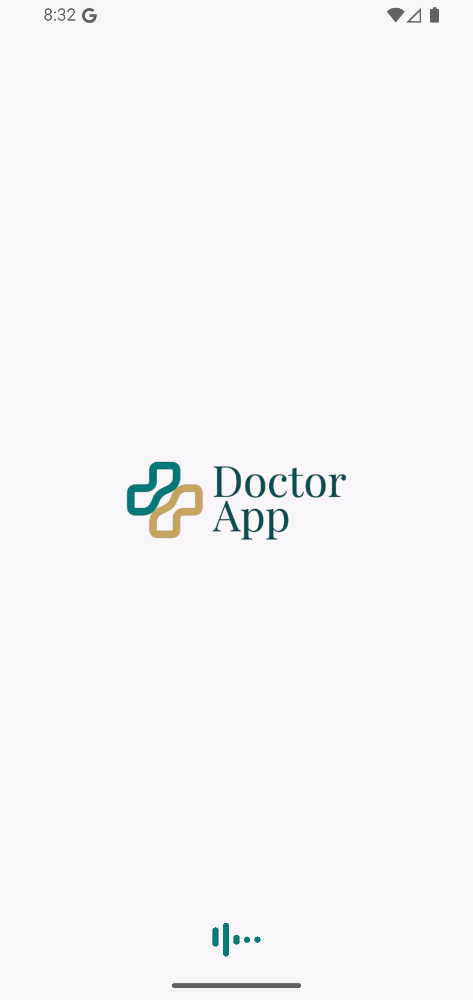 </p>
Login Screen
<p align="center"> 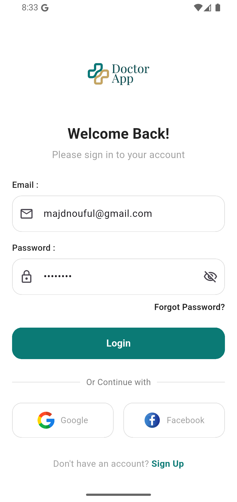 </p>
Register Screen
<p align="center"> 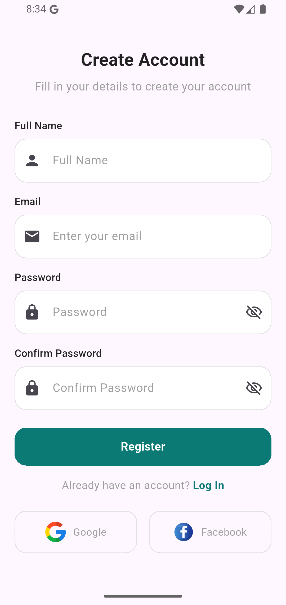 </p>
Google Sign-In
<p align="center">  </p>
Home Screen
<p align="center"> 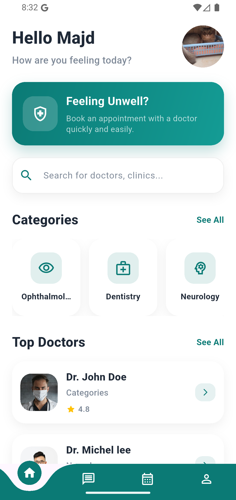 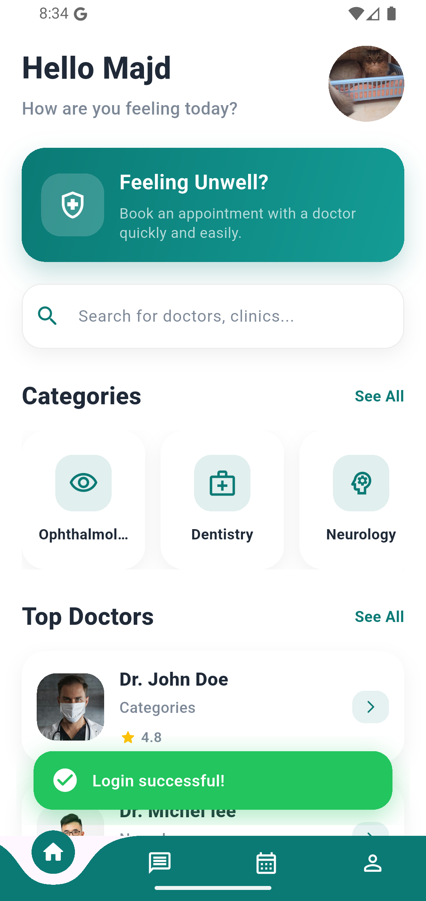 </p>
All Categories
<p align="center"> 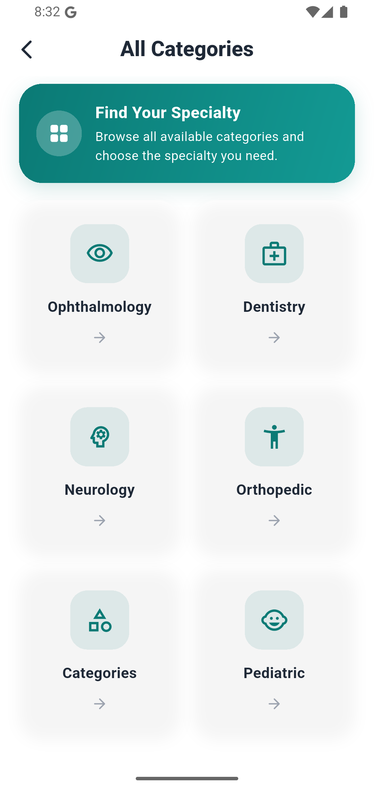 </p>
All Doctors
<p align="center"> 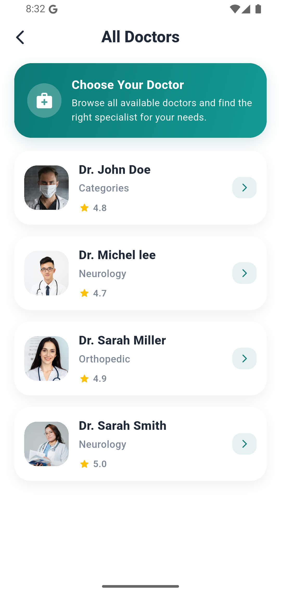 </p>
Doctor Details
<p align="center"> 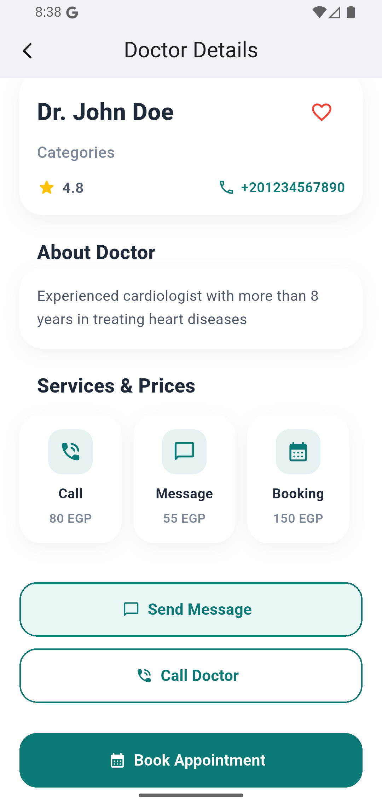 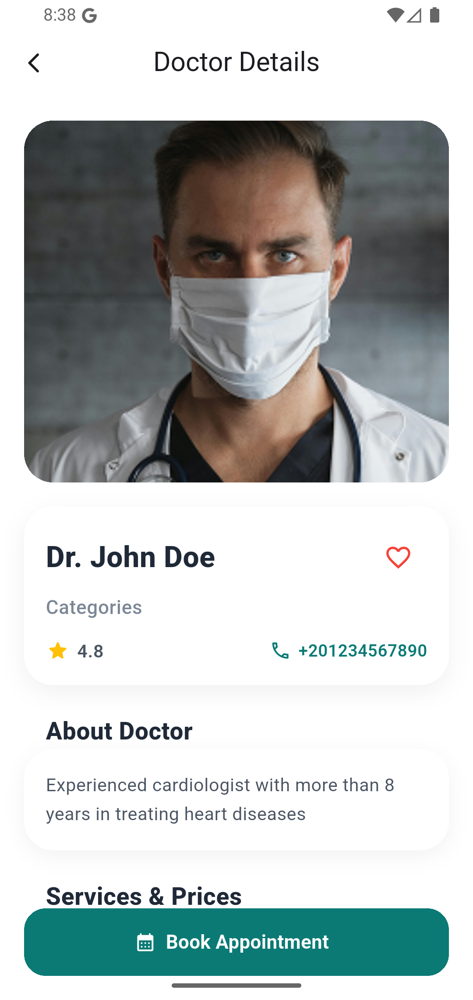 </p>
New Appointment
<p align="center"> 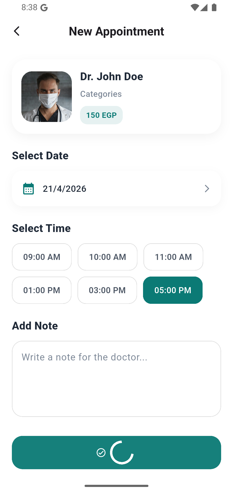 </p>
Appointment Details
<p align="center"> 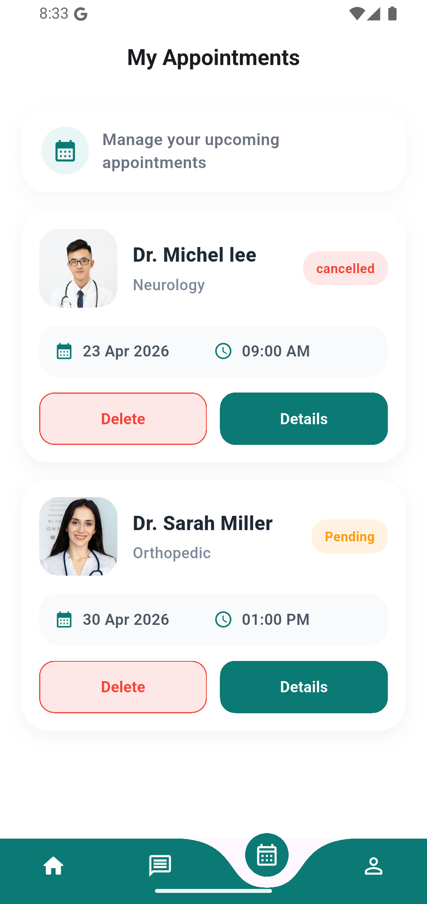 </p>
Appointments Screen
<p align="center"> 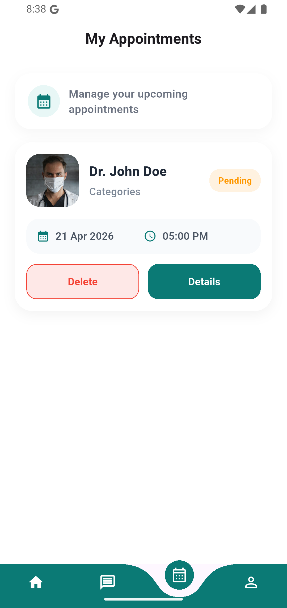 </p>
Delete Appointment
<p align="center"> 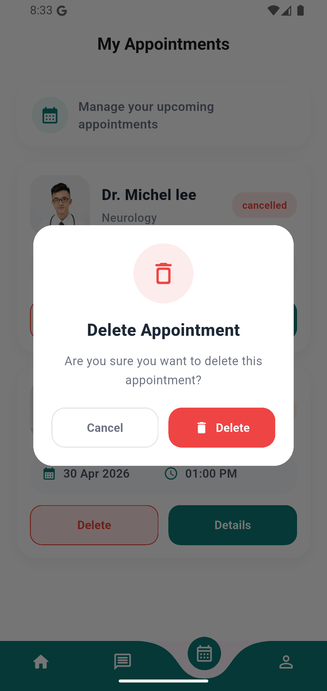 </p>
Success Screen
<p align="center"> 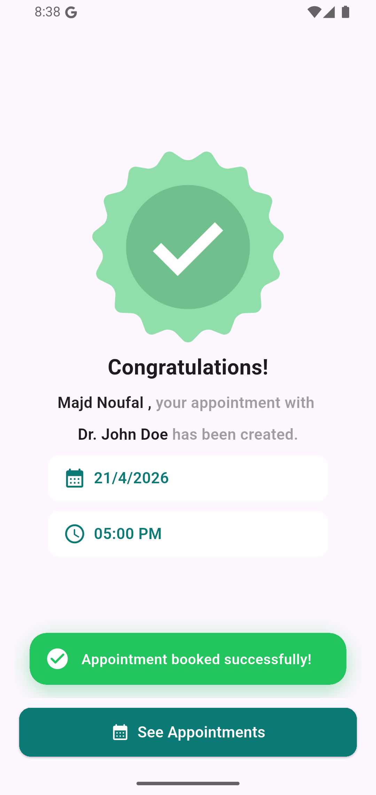 </p>
Messages Screen
<p align="center"> 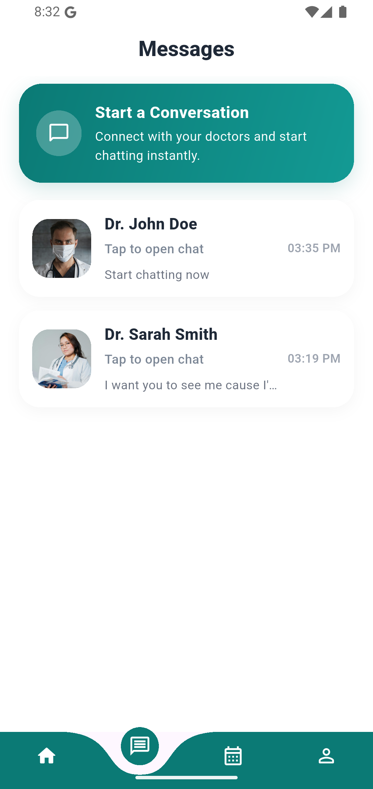 </p>
Chat Screen
<p align="center"> 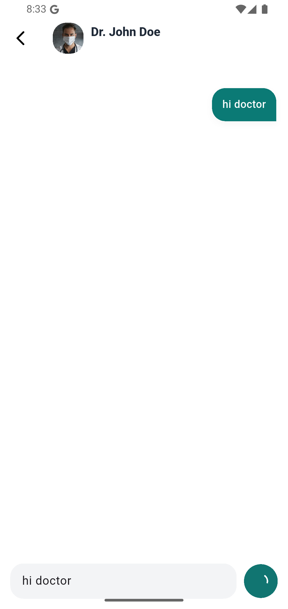 </p>
Profile Screen
<p align="center"> 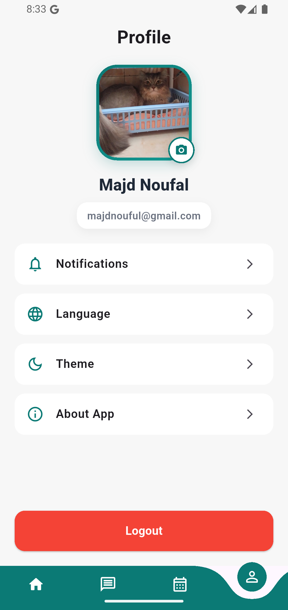 </p>
Logout
<p align="center"> 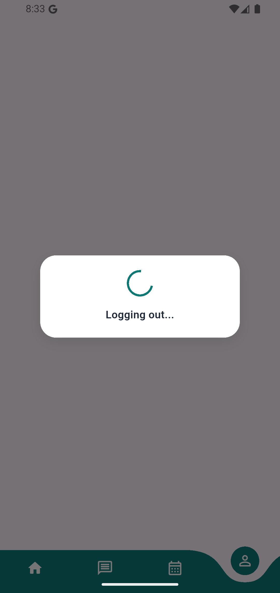 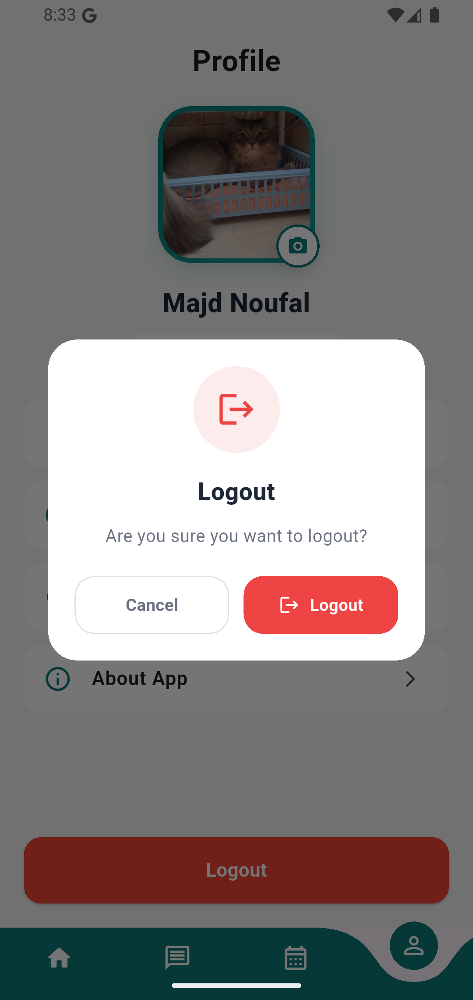 </p>

Demo Video
<p align="center"> 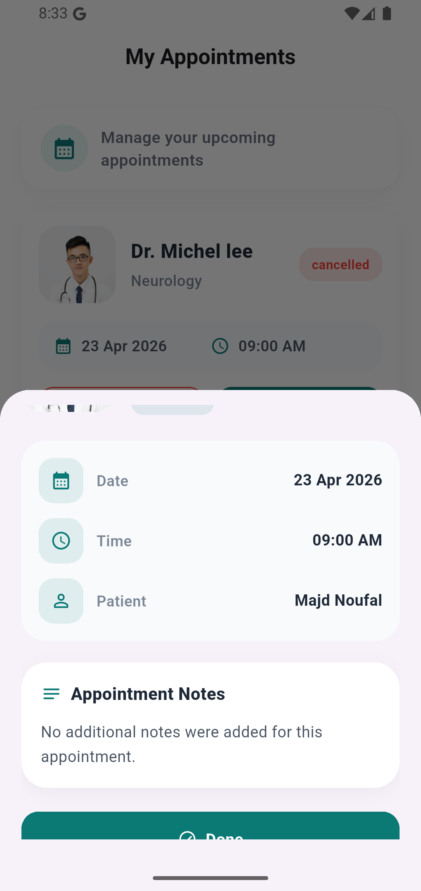 </p>

Demo video will be added soon.

Real-Time Features
. Live chat messages
. Appointment updates from dashboard
. Firestore synchronization
. Automatic conversation creation

Scalability & Future Improvements

This project is designed to be extendable and production-ready.

Future improvements:

Multi-language support
. Dark / Light theme
. Push notifications
. Chat seen status
. Typing indicator
. Online/offline status
. Advanced search & filters
. Role-based system
. File and image sharing in chat

Admin Dashboard

This app is connected to an admin dashboard that allows:

. Manage doctors
. Manage categories
. Manage appointments
. Chat with users

Author:

Majd Noufal
Flutter Developer
